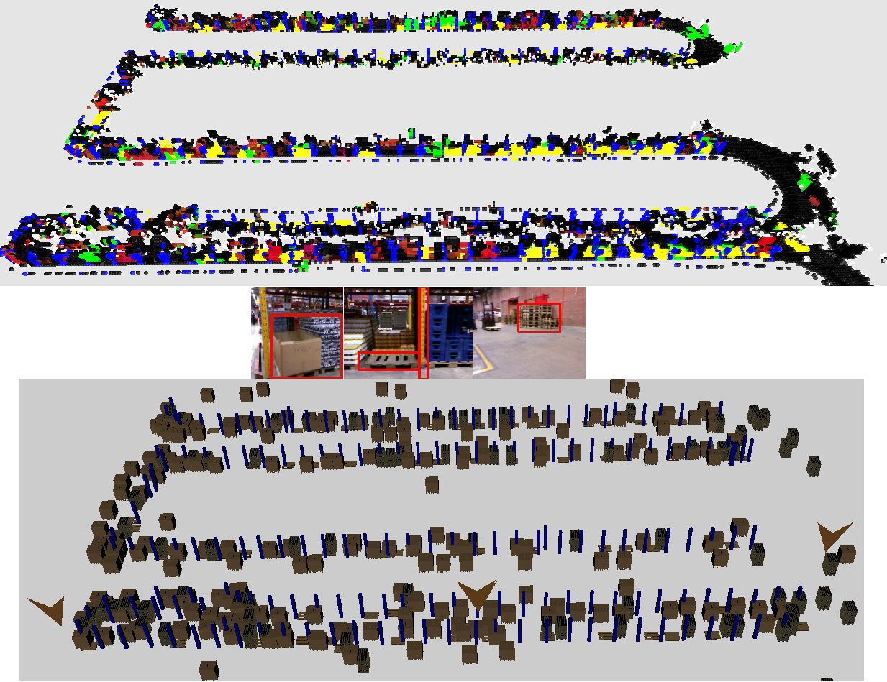

Source Code for the following published work:
=============================================

Relevant Publication: Siddiqui, J. R. , Andreasson, H. , Driankov, D. & Lilienthal, A. J. (2016). Towards visual mapping in industrial environments: a heterogeneous task-specific and saliency driven approach. IEEE International Conference on Robotics and Automation (ICRA). , Stockholm, Sweden, May, 2016.

Dependencies:
=============

ROS (Robot Operating System)
OpenCV
OpenCL
OpenGL
GLUT

3rd Party Libraries:
=====================

egbs
meanshift
dlib

